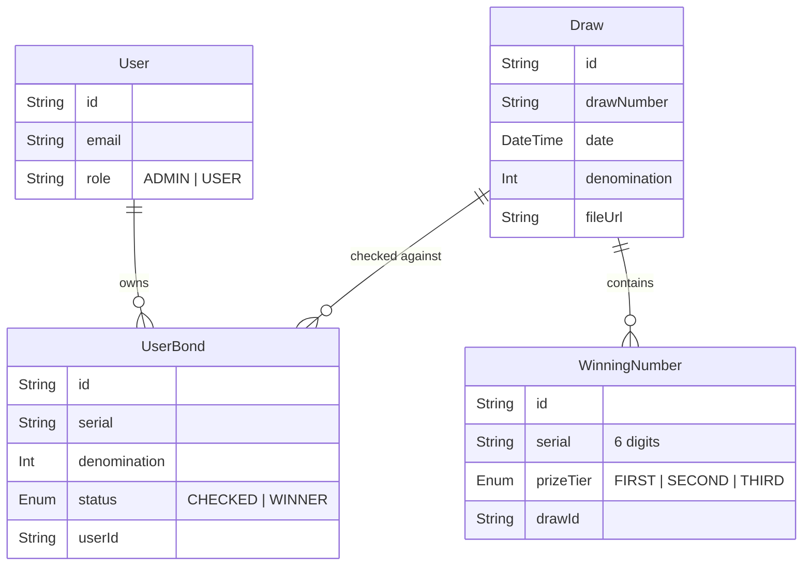

# Prize Bond System: Technical Overview

This document provides a high-level technical description of the Prize Bond backend, including architecture, data models, and core logic.

## 1. System Architecture

The project is built using:
- **Framework**: NestJS (Node.js)
- **Database**: PostgreSQL (via Neon DB)
- **ORM**: Prisma
- **Authentication**: JWT (JSON Web Tokens) with Passport.js
- **File Parsing**: `pdf-parse` for automated result extraction.

---

## 2. Database Schema (Prisma)

The system revolves around three primary entities beyond basic user management.

### Model Descriptions:
| Model Name | Responsibility |
| :--- | :--- |
| **Draw** | Records the official government draw event. Stores metadata like date, city, and denomination. |
| **WinningNumber** | Stores the individual serial numbers that won a prize in a specific draw. |
| **UserBond** | Represents a physical bond owned by a user. The `status` field tracks if the bond has won any prizes. |

---

## 3. Core Logic: The Scrutiny Engine

The centerpiece of the system is the **Scrutiny Service**. 

### How it works:
1. When an admin imports a PDF, the system extracts thousands of `WinningNumbers`.
2. Immediately after storage, the `scrutinizeDraw` logic is triggered.
3. It performs a targeted search across the `UserBond` table for bonds that:
   - Match the **Denomination** of the draw.
   - Match any of the **Serial Numbers** in the winning list.
4. Any match is instantly updated to `status: WINNER`.

---

## 4. Security & Access Control

- **Authenticated Access**: All User and Admin APIs require a valid JWT header (`Authorization: Bearer <TOKEN>`).
- **Role-Based Guards**: 
    - Admins have access to `/admin/*` endpoints to manage draws and upload results.
    - Regular users are restricted to their own `/my-bonds` portfolio.
- **Public Search**: The `/results/check` endpoint remains unauthenticated to allow quick checks from the mobile app's landing page.
